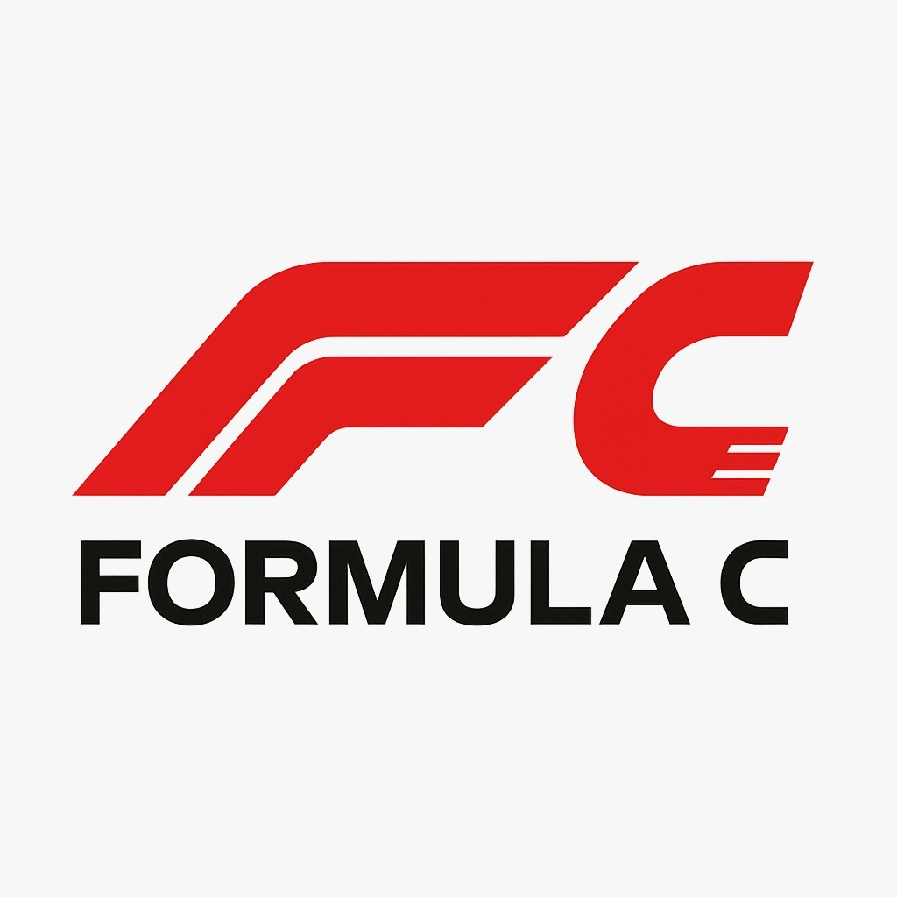

# 🏎️ Formula C
### *"Formula Corridinha"*



**Formula C** é um jogo de corrida em visão **top-down**, onde o jogador controla um carro de Fórmula 1 com dois modos de jogo disponíveis!

O jogo foi desenvolvido em **C** utilizando a biblioteca gráfica **Raylib**

## 👥 Equipe de Desenvolvimento

- [**Eric Gonçalve**](https://github.com/eric-albuquer) 
- [**João Passos**](https://github.com/iampassos)
- [**Mircio Ferreira**](https://github.com/Mircio-Ferreira)

## 🎮 Modos de Jogo

### 🧍‍♂️ Modo 1 Jogador  
O jogador compete contra si mesmo tentando fazer a volta mais rápida. Um **ghost car** (carro fantasma) representa o melhor tempo já feito, servindo como referência durante a corrida.

### 👥 Modo 2 Jogadores  
A tela é dividida em dois (**split screen**) e ambos os jogadores competem entre si. Vence quem completar **3 voltas** primeiro.


## 🛠️ Compilando

### ✅ Instale a Raylib

#### 🔸 macOS
Siga o guia oficial:  
👉 [Raylib no macOS](https://github.com/raysan5/raylib/wiki/Working-on-macOS)

**Dica para usúario MacOs**:

Antes de seguir o guia oficial, tente o método mais simples:

```bash
brew install raylib
```

```bash
make && ./game
```

#### 🔸 Linux
Siga o guia oficial da Raylib:  
👉 [Raylib no GNU/Linux](https://github.com/raysan5/raylib/wiki/Working-on-GNU-Linux)

**Dica para usuários Ubuntu**:  
Antes de seguir o guia oficial, tente o método mais simples:
```bash
sudo apt update
sudo apt install libraylib-dev
```
Agora va para o repositorio do jogo e rode make 

```bash
make && ./game
```

## 🎛️ Menu de Seleção

No menu, você deve escolher:

- **Modo de Jogo:**
  - `1 Jogador` — corra para bater seu próprio recorde.
  - `2 Jogadores` — corrida dividida para competir contra um amigo.

- **Modo do Jogo:**
  - `Normal` — modo padrão para jogar.
  - `Debug` — modo para desenvolvedores, que exibe informações importantes para testes e depuração.

> ⚠️ O modo **Debug** é indicado apenas para desenvolvedores que queiram verificar detalhes técnicos do jogo.


## 🕹️ Como Jogar

### 1°Jogador

- Use as teclas **W, A, S, D** para controlar o carro:
  - **W** — acelerar
  - **A** — manobrar para a esquerda
  - **D** — manobrar para a direita
  - **S** — frear ou dar ré

### 2° jogador

- Use as teclas **UP, DONW, RIGHT, LEFT** para controlar o carro:
  - ⬆️ **Up** — acelerar
  - ⬇️ **DOWN** — manobrar para a esquerda
  - ⬅️ **LEFT** — manobrar para a direita
  - ➡️ **RIGHT** — frear ou dar ré

- A ideia é manter-se dentro da pista.
- Caso saia da pista e entre na área de escape, seu carro será penalizado, perdendo muita velocidade.
> ⚠️ Caso saia desmaciadamente da pista o carro sera teleportado para o ultimo checkpoint.


## 🎬 Vídeo demostrativo


## 🧠 Detalhes Extras da Jogabilidade

A colisão é baseada em **detecção de cores**. Se você selecionar a opção de **modo debug**, poderá visualizar a **malha de cores da pista** e entender exatamente onde estão localizadas as diferentes zonas do jogo.

### 🛰️ Sensor de Cor
Cada carro possui um **sensor invisível ao jogador**, que lê a cor da área por onde está passando. Com base nessa leitura, o comportamento do carro muda de acordo com a cor em que ele está em baixo.

### 🟪 Roxo – Área de Escape Pesada (Brita)
- Representa regiões com **penalidade severa**.
- Simula a **brita** usada em pistas reais.
- Posicionada em áreas críticas onde o jogador poderia tentar **cortar curvas** ou **trapacear**.
- Faz o carro **perder bastante velocidade**.

### 🟧 Laranja – Área de Escape Branda
- Simula uma **zona de escape leve**, usada para conter erros menores.
- Ao entrar, o carro **desacelera**, mas é facil sair dela e retorna a corrida.
- Ideal para situações em que o jogador erra por pouco, **sem intenção de burlar**.

### 🟩 Verde Escuro – Zebra
- Representa **zebras de pista**, normalmente nas bordas.
- Ao passar por essa área, o carro **perde um pouco de velocidade**, mas não é severamente punido.
- Incentiva o jogador a **manter-se na pista principal**.

### 🟢 Verde Claro – Checkpoints
- Indicam **checkpoints** na pista de corrida.
- Sempre que o carro cruza um checkpoint, esse ponto é **salvo**.
- Se o carro sair demasiadamente da pista, ele é **reposicionado no último checkpoint cruzado**.

## 📊 Slides de apresentação

- [**Slides**](https://docs.google.com/presentation/d/1I73oBbLhpJ_45BVkZh4jfdOzE3cGd_-ptOJ7pIYKsCM/edit?usp=sharing)

## 🧐 Curiosidade

O nome **Formula C** surgiu como uma brincadeira com o fato de o jogo ter sido desenvolvido em **C**, durante a disciplina de **PIF** da *CESAR School* ( Que também começa com C).  

Ele também faz referência a um projeto anterior da mesma equipe chamado [**Corridinha**](https://github.com/iampassos/projeto-fp-cesar), criado para a disciplina de *Fundamentos da Programação*, onde foi desenvolvido um CRUD para gerenciamento de um corredor.  

